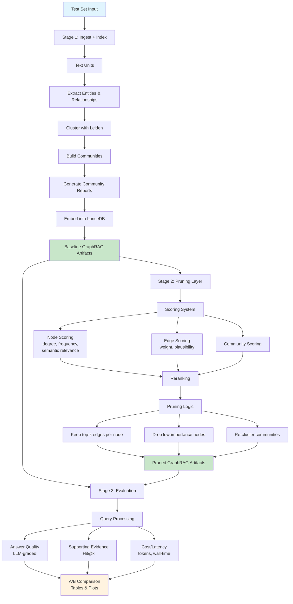

# GraphRAG Pruning Lab — Project Goals & README

> **Pipeline in one sentence:**  
> Ingest a test set → build a GraphRAG index (baseline) → apply custom pruning (scoring + reranking + edge/node reduction) → evaluate whether pruning improves RAG retrieval quality.

## Pipeline Flow



---

## 0) Motivation

Graphs are powerful for retrieval, but real-world graphs quickly become **noisy** and **expensive**. Every additional edge, node, or community increases token usage, latency, and risks irrelevant context.  

This project explores **graph pruning for RAG**:  
- How can we **score and filter** entities/edges/communities to remove low-value structure?  
- Does pruning improve **efficiency** (tokens/latency) while maintaining or improving **retrieval quality**?  

**Key papers**  
- [From Local to Global: A Graph RAG Approach to Query-Focused Summarization (2024)](https://arxiv.org/abs/2404.16130)  
- [Survey on Graph Reduction Techniques (2024)](https://arxiv.org/abs/2402.03358)  
- [PathRAG: Pruning Graph-based Retrieval Augmented Generation with Relational Paths](https://arxiv.org/abs/2502.14902)

**Additional References** 
- [BenchmarkQED: Automated Benchmarking of RAG systems](https://www.microsoft.com/en-us/research/blog/benchmarkqed-automated-benchmarking-of-rag-systems/)

---

## 1) High-level pipeline

### Stage 1 — **Ingest + Index**
- **Input**: a *test set* (to be chosen; placeholder for now).
- **Process**: run through Microsoft’s **default GraphRAG indexing method**:  
  - Chunk into *TextUnits*  
  - Extract Entities & Relationships (LLM-based)  
  - Cluster with Leiden → build Communities  
  - Generate Community Reports  
  - Embed text into LanceDB  
- **Output**: baseline GraphRAG artifacts (`entities.parquet`, `relationships.parquet`, `communities.parquet`, `community_reports.parquet`, `lancedb/`).

### Stage 2 — **Pruning Layer (main research contribution)**  
- Implemented as a **separate script/notebook**.  
- Operates on the GraphRAG outputs (Parquet + LanceDB).  
- Methods may include:  
  - **Scoring** nodes/edges (degree, frequency, semantic relevance, plausibility, etc.).  
  - **Reranking** based on combined scores.  
  - **Pruning**:  
    - keep top-k edges per node,  
    - drop low-importance nodes,  
    - re-cluster communities after pruning.  
- Implementation:  
  - Start with **Microsoft’s built-in pruning knobs** (`prune_graph` in `settings.yaml`).  
  - Extend with **custom scoring + reranking** logic (value-add).  

### Stage 3 — **Evaluation**  
- **Goal**: measure whether pruning improves RAG retrieval.  
- **Eval Harness** (black-box for now, placeholder):  
  - Will run queries against both **baseline GraphRAG** and **pruned GraphRAG**.  
  - Compare on:  
    - Answer quality (LLM-graded / rubric)  
    - Supporting evidence retrieval (Hit@k)  
    - Cost/latency (tokens, wall-time)  
- **Output**: A/B comparison tables and plots.

---

## 2) Project repo structure

```text
graphrag-pruning-lab/
├─ data/
│  ├─ input/                 # test set (to be defined)
│  └─ gold/                  # evaluation Q&A pairs (black box placeholder)
├─ workspace/                # GraphRAG workspace
│  ├─ settings.yaml
│  └─ output/                # entities, relationships, communities, reports, vectors
├─ ingest/
│  └─ build_index.py         # script: run Microsoft GraphRAG default indexing
├─ pruning/
│  ├─ prune_graph.py         # your script (scoring, reranking, pruning)
│  └─ scoring_utils.py
├─ eval/
│  ├─ run_eval.py            # black-box evaluation harness (placeholder first)
│  └─ metrics.py             # Hit@k, token cost, answer grading
└─ README.md                 # this file
````

---

## 3) Implementation checkpoints

1. **Baseline index**

   * Run `ingest/build_index.py` to produce GraphRAG baseline.
   * Confirm Parquet + LanceDB outputs exist.

2. **Pruning script (MVP)**

   * Implement simple scoring (`degree + frequency`, `edge weight`).
   * Keep top-k edges per node; re-cluster.
   * Save pruned artifacts.

3. **Evaluation harness**

   * Set up placeholder eval with dummy queries.
   * Later plug in real test set + gold Q\&A pairs.

4. **Extended pruning**

   * Add semantic relevance, KGE plausibility, or other signals.
   * Run ablation studies (baseline vs pruned vs extended pruning).

5. **Final report**

   * Summarize findings in tables/plots.
   * Answer: *does pruning improve efficiency without hurting quality?*

---

### initializing the env
This project uses pixi for env management:
https://pixi.sh/dev/

To initialize the pixi environment and activate the shell:
```bash
pixi install
```

```bash
pixi shell
```