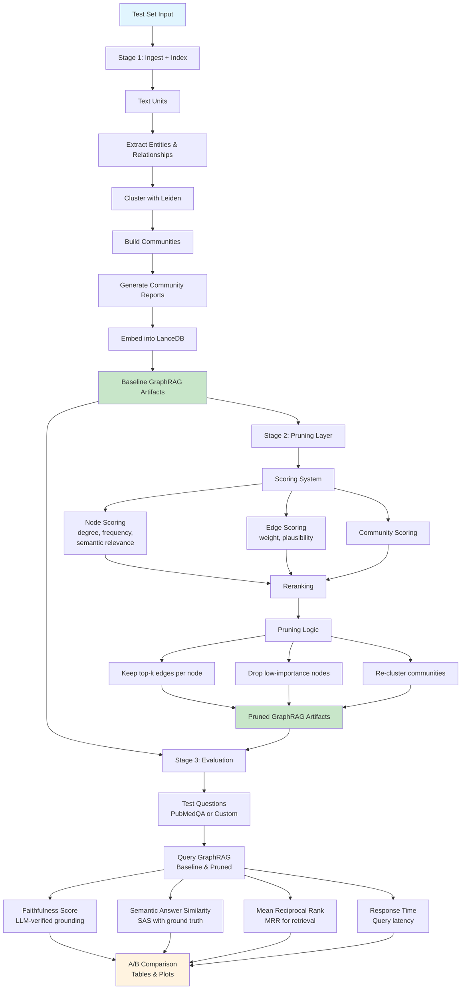

# GraphRAG Pruning Lab — Project Goals & README

> **Pipeline in one sentence:**  
> Ingest a test set → build a GraphRAG index (baseline) → apply custom pruning (scoring + reranking + edge/node reduction) → evaluate whether pruning improves RAG retrieval quality.

## Pipeline Flow


```mermaid
graph TD
    A[Test Set Input] --> B[Stage 1: Ingest + Index]
    B --> C[Text Units]
    C --> D[Extract Entities & Relationships]
    D --> E[Cluster with Leiden]
    E --> F[Build Communities]
    F --> G[Generate Community Reports]
    G --> H[Embed into LanceDB]
    H --> I[Baseline GraphRAG Artifacts]
    I --> J[Stage 2: Pruning Layer]
    J --> K[Scoring System]
    K --> L[Node Scoring<br/>degree, frequency,<br/>semantic relevance]
    K --> M[Edge Scoring<br/>weight, plausibility]
    K --> N[Community Scoring]
    L --> O[Reranking]
    M --> O
    N --> O
    O --> P[Pruning Logic]
    P --> Q[Keep top-k edges per node]
    P --> R[Drop low-importance nodes]
    P --> S[Re-cluster communities]
    Q --> T[Pruned GraphRAG Artifacts]
    R --> T
    S --> T
    I --> U[Stage 3: Evaluation]
    T --> U
    U --> V[Test Questions<br/>PubMedQA or Custom]
    V --> W[Query GraphRAG<br/>Baseline & Pruned]
    W --> X[Faithfulness Score<br/>LLM-verified grounding]
    W --> Y[Semantic Answer Similarity<br/>SAS with ground truth]
    W --> Z[Mean Reciprocal Rank<br/>MRR for retrieval]
    W --> AA[Response Time<br/>Query latency]
    X --> BB[A/B Comparison<br/>Tables & Plots]
    Y --> BB
    Z --> BB
    AA --> BB

    style A fill:#e1f5fe
    style I fill:#c8e6c9
    style T fill:#c8e6c9
    style BB fill:#fff3e0
```

---

## 0) Motivation

Graphs are powerful for retrieval, but real-world graphs quickly become **noisy** and **expensive**. Every additional edge, node, or community increases token usage, latency, and risks irrelevant context.  

This project explores **graph pruning for RAG**:  
- How can we **score and filter** entities/edges/communities to remove low-value structure?  
- Does pruning improve **efficiency** (tokens/latency) while maintaining or improving **retrieval quality**?  

**Key papers**  
- [From Local to Global: A Graph RAG Approach to Query-Focused Summarization (2024)](https://arxiv.org/abs/2404.16130)  
- [Survey on Graph Reduction Techniques (2024)](https://arxiv.org/abs/2402.03358)  
- [PathRAG: Pruning Graph-based Retrieval Augmented Generation with Relational Paths](https://arxiv.org/abs/2502.14902)

**Additional References** 
- [BenchmarkQED: Automated Benchmarking of RAG systems](https://www.microsoft.com/en-us/research/blog/benchmarkqed-automated-benchmarking-of-rag-systems/)

---

## 1) High-level pipeline

### Stage 1 — **Ingest + Index**
- **Input**: a *test set* (to be chosen; placeholder for now).
- **Process**: run through Microsoft’s **default GraphRAG indexing method**:  
  - Chunk into *TextUnits*  
  - Extract Entities & Relationships (LLM-based)  
  - Cluster with Leiden → build Communities  
  - Generate Community Reports  
  - Embed text into LanceDB  
- **Output**: baseline GraphRAG artifacts (`entities.parquet`, `relationships.parquet`, `communities.parquet`, `community_reports.parquet`, `lancedb/`).

### Stage 2 — **Pruning Layer (main research contribution)**
- Implemented as a **separate module** in `pruning/`.
- Operates on the GraphRAG outputs (Parquet + LanceDB).

**Implemented Strategies:**

1. **HFBP (Hierarchical Flow-Based Pruning)**
   - Leiden clustering → supernodes (20-50 nodes each)
   - Query-aware enhancement with supernode matching
   - Resource propagation with flow-based scoring
   - Beam search path enumeration
   - For graphs 50k+ nodes

2. **SuperHFBP (Enhanced Context-Aware Pruning)** ⭐
   - All HFBP features plus:
   - **Context nodes**: Top-20% by query similarity act as anchors
   - **Global query detection**: LLM-based (GPT-4o-mini) or keyword heuristics
   - **Density filtering**: Inter-community edges only if density >5%
   - **Enhanced scoring**: S(P) = (1/|E|)·ΣS(v) + β·(|C_q∩V_P|/|C_q|)
   - **Context penalty**: 0.8× if path excludes context nodes
   - **Supernode summaries**: Enhanced textual paths for LLM prompting
   - **Target**: 10-20% token savings, +8% faithfulness improvement

**Parameters:**
- β (context bonus): 0.2 default, 0.15-0.3 range
- context_top_pct: 20% default
- context_penalty: 0.8 default
- inter_community_density_threshold: 0.05 (5%)

**Usage:**

*Online Mode (Path-based retrieval):*
```python
from pruning import SuperHFBP, SuperHFBPConfig

config = SuperHFBPConfig(beta=0.2, context_top_pct=0.2, context_penalty=0.8)
super_hfbp = SuperHFBP(entities_df, relationships_df, config=config)
result = super_hfbp.execute(query, retrieved_nodes)
```

*Offline Mode (Pruned graph export):*
```bash
# Generate pruned GraphRAG artifacts for downstream evaluation
python pruning/run_superhfbp_pruning.py \
  --workspace workspace \
  --output workspace/pruned_superhfbp \
  --mode auto --num-queries 10

# Or run complete pipeline (prune → eval)
./run_superhfbp_pipeline.sh --num-queries 10 --questions 50
```  

### Stage 3 — **Evaluation**
- **Goal**: measure whether pruning improves RAG retrieval quality while maintaining efficiency.
- **Test Data**: Uses PubMedQA dataset (biomedical Q&A) or custom test questions with ground truth answers (see `data/gold/test_questions.json` for example).
- **Evaluation Metrics**:
  - **Faithfulness Score** (0-1, higher better): LLM-verified answer grounding in retrieved documents. No ground truth needed.
  - **Semantic Answer Similarity (SAS)** (-1 to 1, higher better): Semantic similarity to ground truth answers using sentence transformers.
  - **Mean Reciprocal Rank (MRR)** (0-1, higher better): Retrieval quality metric measuring rank of relevant documents.
  - **Response Time**: Average query latency in seconds (lower better).
- **LLM Support**: OpenAI (default), Ollama (local), or OpenRouter (various models).
- **Output**: A/B comparison tables, plots, and detailed per-question results.

---

## 2) Project repo structure

```text
graphrag/
├─ data/
│  ├─ input/                        # test set documents
│  └─ gold/input/passages.jsonl     # PubMedQA evaluation dataset
├─ workspace/                       # GraphRAG workspace
│  ├─ settings.yaml
│  └─ output/                       # baseline artifacts (parquet + lancedb)
├─ ingest/
│  └─ build_index.py                # GraphRAG indexing pipeline
├─ pruning/
│  ├─ hfbp_pruning.py               # HFBP implementation (940 lines)
│  ├─ super_hfbp_pruning.py         # SuperHFBP implementation (513 lines) ⭐
│  ├─ prune_graph.py                # Graph pruning framework
│  ├─ scoring_utils.py              # Scoring utilities
│  ├─ test.py                       # Validation tests
│  └─ __init__.py
├─ eval/
│  ├─ generate_answers_superhfbp.py # SuperHFBP evaluation integration ⭐
│  ├─ eval.py                       # Core metrics (faithfulness, SAS, MRR)
│  ├─ ablation_config.json          # HFBP/SuperHFBP configurations ⭐
│  └─ pixi.toml
└─ README.md                        # this file
```

---

## 3) Implementation Status

✅ **Completed:**

1. **Baseline GraphRAG Index**
   - Microsoft GraphRAG indexing pipeline (`ingest/build_index.py`)
   - Parquet artifacts + LanceDB vector store
   - PubMedQA biomedical dataset integration

2. **HFBP (Hierarchical Flow-Based Pruning)**
   - Complete PathRAG-inspired implementation
   - Leiden clustering, resource propagation, beam search
   - Production-ready for 50k+ node graphs

3. **SuperHFBP (Enhanced Context-Aware Pruning)** ⭐
   - Context node identification (top-K% by query similarity)
   - Global query detection (LLM + heuristics)
   - Inter-community density filtering (>5%)
   - Enhanced reliability scoring with context bonus/penalty
   - Supernode summaries for LLM prompting
   - **NEW:** Pruned graph export as GraphRAG artifacts
   - **Validated:** All tests passing, production-ready

4. **Evaluation Integration**
   - Full pipeline integration (`eval/generate_answers_superhfbp.py`)
   - 6 ablation configurations (HFBP + SuperHFBP variants)
   - **NEW:** Offline evaluation on pruned artifacts
   - **NEW:** Complete pipeline script (`run_superhfbp_pipeline.sh`)
   - LLM-based answer generation with OpenAI
   - Metrics: Faithfulness, SAS, MRR, response time

5. **Pruning Strategy Overhaul (Experimental)**
   - Plain POG/PathRAG pipelines retired in favour of tuned hybrid variants.
   - KGTrimmer rebuilt with cached/normalised metrics for ~55% reduction targets.
   - Adaptive Multi-Strategy now blends KG + hybrid signals while enforcing connectivity.

📋 **Next Steps:**

1. **Run validation:** `python pruning/test.py`
2. **Run evaluation:** Use commands in section 4
3. **Analyze results:** Compare SuperHFBP variants vs baseline
4. **Expected improvements:** 10-20% token savings, +8% faithfulness

---

## 4) Running the Full Pipeline

### Quick Start (Complete Workflow)

```bash
# 1. Set up environments
pixi install                    # Main environment
cd eval && pixi install        # Eval environment

# 2. Build baseline index
python ingest/build_index.py

# 3. Validate SuperHFBP implementation
python pruning/test.py

# 4. Run SuperHFBP evaluation (single config)
python eval/generate_answers_superhfbp.py \
  --workspace workspace \
  --questions 50 \
  --config superhfbp_default \
  --openai-api-key $OPENAI_API_KEY
```

### Offline Pruning + Evaluation (NEW ⭐)

**Generate pruned graph artifacts, then evaluate:**

```bash
# Complete pipeline: prune → eval
./run_superhfbp_pipeline.sh --num-queries 10 --questions 50

# Or run steps separately:

# Step 1: Generate pruned graph
python pruning/run_superhfbp_pruning.py \
  --workspace workspace \
  --output workspace/pruned_superhfbp \
  --mode auto --num-queries 10

# Step 2: Evaluate on pruned graph
python eval/generate_answers.py \
  --config superhfbp_pruned_graph \
  --questions 50
```

**Pruning modes:**
- `--mode auto`: Auto-generates representative queries
- `--mode file --queries queries.txt`: Uses custom queries from file
- `--config config.json`: Custom SuperHFBP configuration

### Ablation Study (Multiple HFBP/SuperHFBP Configurations)

```bash
# Run all HFBP and SuperHFBP configurations
python eval/generate_answers_superhfbp.py \
  --workspace workspace \
  --questions 100 \
  --ablation \
  --ablation-config eval/ablation_config.json \
  --openai-api-key $OPENAI_API_KEY
```

**Available Configurations** (in `eval/ablation_config.json`):

*Online Pruning (path-based):*
- `hfbp`: Baseline HFBP
- `superhfbp_default`: Standard context-aware pruning (β=0.2)
- `superhfbp_high_precision`: Stronger context forcing (β=0.3, penalty=0.7)
- `superhfbp_high_recall`: Relaxed pruning (β=0.15, top_pct=0.25)
- `superhfbp_no_context_penalty`: Ablation without penalty
- `superhfbp_no_density_filter`: Ablation without density threshold

*Offline Pruning (artifact-based):*
- `superhfbp_pruned_graph`: Evaluation on SuperHFBP-pruned artifacts
- `hfbp_pruned_graph`: Evaluation on HFBP-pruned artifacts

---

## 5) Environment Setup

This project uses **pixi** for environment management: https://pixi.sh/dev/

```bash
# Install main environment
pixi install

# Install eval environment
cd eval && pixi install

# Activate shell (optional)
pixi shell
```

---

## 6) Key Files

**Core Implementation:**
- `pruning/super_hfbp_pruning.py` - SuperHFBP algorithm with pruned graph export (650+ lines)
- `pruning/hfbp_pruning.py` - Base HFBP implementation (940 lines)
- `pruning/run_superhfbp_pruning.py` - Standalone pruning script (NEW ⭐)
- `pruning/test.py` - Validation tests
- `pruning/SUPERHFBP_README.md` - Detailed SuperHFBP documentation (NEW ⭐)

**Evaluation:**
- `eval/generate_answers_superhfbp.py` - SuperHFBP eval integration (400+ lines)
- `eval/ablation_config.json` - 8 configurations (HFBP/SuperHFBP + pruned variants)
- `eval/eval.py` - Metrics (faithfulness, SAS, MRR)

**Pipeline:**
- `run_superhfbp_pipeline.sh` - Complete prune → eval pipeline (NEW ⭐)

**Configuration:**
- `workspace/settings.yaml` - GraphRAG indexing settings
- `pixi.toml` - Main dependencies

---

## 7) SuperHFBP Algorithm Details

**Enhancements over HFBP:**

1. **Context Nodes (C_q)**
   - Top-20% nodes by query-embedding similarity
   - Plus supernode representatives if global query detected
   - Act as anchors that paths should include

2. **Global Query Detection**
   - LLM-based (GPT-4o-mini) with keyword fallback
   - Keywords: summarize, overview, trends, comprehensive, etc.
   - Adds all supernode representatives to context set

3. **Density Filtering**
   - Inter-community edges only added if density ≥ 5%
   - Density = |inter_edges| / (|community_1| × |community_2|)
   - Reduces noise in supergraph

4. **Enhanced Scoring**
   ```
   S(P) = (1/|E_P|) × Σ S(v) + β × (|C_q ∩ V_P| / |C_q|)
          └─ base score ─┘     └─── context bonus ───┘

   If |C_q ∩ V_P| = 0: multiply base by context_penalty (0.8)
   ```

5. **Enhanced Textual Paths**
   - Includes supernode summaries
   - Marks context nodes with [CONTEXT]
   - Marks supernode reps with [SUPERNODE_REP]
   - Hierarchical structure for LLM prompting

**Complexity:** O(N² / ((1-α)θ) × |S|/|V|) where |S| << |V|