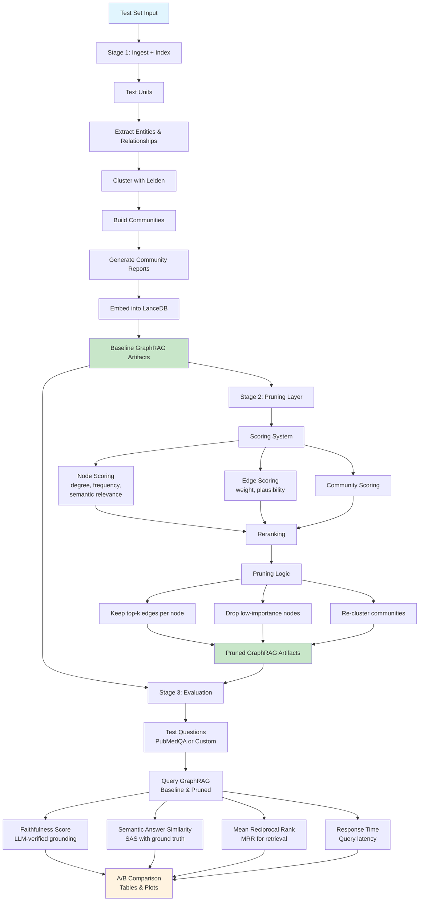

# GraphRAG Pruning Lab — Project Goals & README

> **Pipeline in one sentence:**  
> Ingest a test set → build a GraphRAG index (baseline) → apply custom pruning (scoring + reranking + edge/node reduction) → evaluate whether pruning improves RAG retrieval quality.

## Pipeline Flow


```mermaid
graph TD
    A[Test Set Input] --> B[Stage 1: Ingest + Index]
    B --> C[Text Units]
    C --> D[Extract Entities & Relationships]
    D --> E[Cluster with Leiden]
    E --> F[Build Communities]
    F --> G[Generate Community Reports]
    G --> H[Embed into LanceDB]
    H --> I[Baseline GraphRAG Artifacts]
    I --> J[Stage 2: Pruning Layer]
    J --> K[Scoring System]
    K --> L[Node Scoring<br/>degree, frequency,<br/>semantic relevance]
    K --> M[Edge Scoring<br/>weight, plausibility]
    K --> N[Community Scoring]
    L --> O[Reranking]
    M --> O
    N --> O
    O --> P[Pruning Logic]
    P --> Q[Keep top-k edges per node]
    P --> R[Drop low-importance nodes]
    P --> S[Re-cluster communities]
    Q --> T[Pruned GraphRAG Artifacts]
    R --> T
    S --> T
    I --> U[Stage 3: Evaluation]
    T --> U
    U --> V[Test Questions<br/>PubMedQA or Custom]
    V --> W[Query GraphRAG<br/>Baseline & Pruned]
    W --> X[Faithfulness Score<br/>LLM-verified grounding]
    W --> Y[Semantic Answer Similarity<br/>SAS with ground truth]
    W --> Z[Mean Reciprocal Rank<br/>MRR for retrieval]
    W --> AA[Response Time<br/>Query latency]
    X --> BB[A/B Comparison<br/>Tables & Plots]
    Y --> BB
    Z --> BB
    AA --> BB

    style A fill:#e1f5fe
    style I fill:#c8e6c9
    style T fill:#c8e6c9
    style BB fill:#fff3e0
```

---

## 0) Motivation

Graphs are powerful for retrieval, but real-world graphs quickly become **noisy** and **expensive**. Every additional edge, node, or community increases token usage, latency, and risks irrelevant context.  

This project explores **graph pruning for RAG**:  
- How can we **score and filter** entities/edges/communities to remove low-value structure?  
- Does pruning improve **efficiency** (tokens/latency) while maintaining or improving **retrieval quality**?  

**Key papers**  
- [From Local to Global: A Graph RAG Approach to Query-Focused Summarization (2024)](https://arxiv.org/abs/2404.16130)  
- [Survey on Graph Reduction Techniques (2024)](https://arxiv.org/abs/2402.03358)  
- [PathRAG: Pruning Graph-based Retrieval Augmented Generation with Relational Paths](https://arxiv.org/abs/2502.14902)

**Additional References** 
- [BenchmarkQED: Automated Benchmarking of RAG systems](https://www.microsoft.com/en-us/research/blog/benchmarkqed-automated-benchmarking-of-rag-systems/)

---

## 1) High-level pipeline

### Stage 1 — **Ingest + Index**
- **Input**: a *test set* (to be chosen; placeholder for now).
- **Process**: run through Microsoft’s **default GraphRAG indexing method**:  
  - Chunk into *TextUnits*  
  - Extract Entities & Relationships (LLM-based)  
  - Cluster with Leiden → build Communities  
  - Generate Community Reports  
  - Embed text into LanceDB  
- **Output**: baseline GraphRAG artifacts (`entities.parquet`, `relationships.parquet`, `communities.parquet`, `community_reports.parquet`, `lancedb/`).

### Stage 2 — **Pruning Layer (main research contribution)**  
- Implemented as a **separate script/notebook**.  
- Operates on the GraphRAG outputs (Parquet + LanceDB).  
- Methods may include:  
  - **Scoring** nodes/edges (degree, frequency, semantic relevance, plausibility, etc.).  
  - **Reranking** based on combined scores.  
  - **Pruning**:  
    - keep top-k edges per node,  
    - drop low-importance nodes,  
    - re-cluster communities after pruning.  
- Implementation:  
  - Start with **Microsoft’s built-in pruning knobs** (`prune_graph` in `settings.yaml`).  
  - Extend with **custom scoring + reranking** logic (value-add).  

### Stage 3 — **Evaluation**
- **Goal**: measure whether pruning improves RAG retrieval quality while maintaining efficiency.
- **Test Data**: Uses PubMedQA dataset (biomedical Q&A) or custom test questions with ground truth answers (see `data/gold/test_questions.json` for example).
- **Evaluation Metrics**:
  - **Faithfulness Score** (0-1, higher better): LLM-verified answer grounding in retrieved documents. No ground truth needed.
  - **Semantic Answer Similarity (SAS)** (-1 to 1, higher better): Semantic similarity to ground truth answers using sentence transformers.
  - **Mean Reciprocal Rank (MRR)** (0-1, higher better): Retrieval quality metric measuring rank of relevant documents.
  - **Response Time**: Average query latency in seconds (lower better).
- **LLM Support**: OpenAI (default), Ollama (local), or OpenRouter (various models).
- **Output**: A/B comparison tables, plots, and detailed per-question results.

---

## 2) Project repo structure

```text
graphrag-pruning-lab/
├─ data/
│  ├─ input/                 # test set (to be defined)
│  └─ gold/                  # evaluation Q&A pairs (black box placeholder)
├─ workspace/                # GraphRAG workspace
│  ├─ settings.yaml
│  └─ output/                # entities, relationships, communities, reports, vectors
├─ ingest/
│  └─ build_index.py         # script: run Microsoft GraphRAG default indexing
├─ pruning/
│  ├─ prune_graph.py         # your script (scoring, reranking, pruning)
│  └─ scoring_utils.py
├─ eval/
│  ├─ run_eval.py            # evaluation runner for baseline vs pruned comparison
│  ├─ eval.py                # core evaluation functions (faithfulness, SAS, MRR)
│  ├─ eval_usage.py          # example usage with different LLM providers
│  ├─ ablation_config.json   # configuration for ablation studies
│  └─ pixi.toml              # evaluation environment dependencies
└─ README.md                 # this file
````

---

## 3) Implementation checkpoints

1. **Baseline index**

   * Run `ingest/build_index.py` to produce GraphRAG baseline.
   * Confirm Parquet + LanceDB outputs exist.

2. **Pruning script (MVP)**

   * Implement simple scoring (`degree + frequency`, `edge weight`).
   * Keep top-k edges per node; re-cluster.
   * Save pruned artifacts.

3. **Evaluation harness setup**

   * Set up eval environment: `cd eval && pixi install`
   * Test evaluation with mock data: `python run_eval.py --baseline workspace/output --pruned workspace/pruned_output`
   * Configure LLM provider (OpenAI/Ollama/OpenRouter) for faithfulness scoring
   * Test with PubMedQA: `python run_eval.py --use-pubmedqa --pubmedqa-samples 10 [other args]`

4. **Extended pruning**

   * Add semantic relevance, KGE plausibility, or other signals.
   * Run ablation studies (baseline vs pruned vs extended pruning).

5. **Final report**

   * Summarize findings in tables/plots.
   * Answer: *does pruning improve efficiency without hurting quality?*

---

## 4) Running the Full Pipeline

### Quick Start (Complete Workflow)

```bash
# 1. Set up environments
pixi install                    # Main environment
cd eval && pixi install        # Eval environment

# 2. Build baseline index
python ingest/build_index.py

# 3. Apply pruning (implement your logic in pruning/scoring_utils.py & prune_graph.py)
python pruning/prune_graph.py --baseline workspace/output --output workspace/pruned_output

# 4. Run evaluation comparison
python eval/run_eval.py \
  --baseline workspace/output \
  --pruned workspace/pruned_output \
  --use-pubmedqa \
  --pubmedqa-samples 50 \
  --output-dir eval/results
```

### Ablation Study (Multiple Pruning Strategies)

```bash
python eval/run_eval.py \
  --ablation \
  --ablation-config eval/ablation_config.json \
  --use-pubmedqa \
  --pubmedqa-samples 100 \
  --output-dir eval/results
```

### Key Integration Points

1. **GraphRAG Query Interface**: The eval system expects a `RAGSystemInterface` implementation. Currently uses `MockGraphRAGSystem` - you'll need to create `GraphRAGSystem` that actually queries your GraphRAG index.

2. **Test Data Alignment**: The eval system uses PubMedQA by default, but your input data is `book.txt`. Consider creating domain-relevant test questions that match your document content.

3. **Pruning Artifacts**: The eval system expects pruned artifacts in the same format as baseline (parquet files + lancedb), so your pruning implementation needs to maintain this structure.

---

### initializing the env
This project uses pixi for env management:
https://pixi.sh/dev/

To initialize the pixi environment and activate the shell:
```bash
pixi install
```

```bash
pixi shell
```


**Scoring (`pruning/scoring_utils.py`):**
- `GraphScorer.score_nodes_*()` - Implement node scoring methods
- `GraphScorer.score_edges_*()` - Implement edge scoring methods
- `GraphScorer.score_communities_*()` - Implement community scoring methods
- `GraphScorer.get_combined_*_scores()` - Combine multiple scoring methods

**Pruning (`pruning/prune_graph.py`):**
- `GraphPruner.prune_nodes()` - Implement node pruning strategies
- `GraphPruner.prune_edges()` - Implement edge pruning strategies
- `GraphPruner.prune_communities()` - Implement community pruning strategies
- `GraphPruner.apply_pruning_pipeline()` - Orchestrate the pruning process

**Evaluation (`eval/metrics.py`):**
- `RAGEvaluator.evaluate_answer_quality()` - Implement answer quality metrics
- `RAGEvaluator.evaluate_retrieval_quality()` - Implement retrieval metrics
- `RAGEvaluator.evaluate_efficiency()` - Implement efficiency metrics

### Example Implementation Workflow

1. **Start with scoring:**
   ```python
   from pruning.scoring_utils import GraphScorer, load_graphrag_artifacts

   # Load your baseline artifacts
   entities_df, relationships_df, communities_df = load_graphrag_artifacts("workspace/output")
   scorer = GraphScorer(entities_df, relationships_df, communities_df)

   # Implement your first scoring method
   def score_nodes_degree_centrality(self):
       # Your implementation here
       pass
   ```

2. **Add pruning logic:**
   ```python
   from pruning.prune_graph import GraphPruner

   # Initialize pruner
   pruner = GraphPruner(baseline_dir, output_dir)

   # Implement your pruning strategy
   def prune_nodes(self, strategy="top_k", **kwargs):
       # Your pruning logic here
       pass
   ```

3. **Add evaluation metrics:**
   ```python
   from eval.metrics import RAGEvaluator

   # Initialize evaluator
   evaluator = RAGEvaluator()

   # Implement your evaluation method
   def evaluate_answer_quality(self, predicted, reference):
       # Your evaluation logic here
       pass
   ```

The framework is designed to be modular - implement one component at a time and test incrementally!