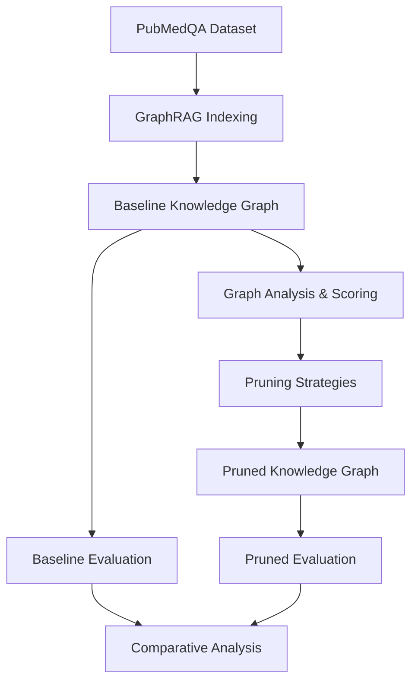

# Graph Pruning for Retrieval-Augmented Generation: A Systematic Study

## Abstract

This research investigates the effectiveness of graph pruning techniques in improving the efficiency of GraphRAG (Graph-based Retrieval-Augmented Generation) systems while maintaining retrieval quality. We propose a systematic approach to scoring and pruning knowledge graph components—nodes, edges, and communities—and evaluate the impact on both computational efficiency and answer quality using biomedical question-answering tasks.

## 1. Introduction

### 1.1 Problem Statement

GraphRAG systems construct knowledge graphs from document collections to enhance retrieval-augmented generation, but these graphs can become computationally expensive and noisy at scale. Every additional node, edge, and community increases token usage, query latency, and risks introducing irrelevant context that may degrade answer quality.

### 1.2 Research Question

**Can systematic graph pruning improve GraphRAG efficiency (reduced latency, token usage, and computational cost) while maintaining or improving retrieval quality and answer faithfulness?**

### 1.3 Contributions

1. **Systematic Pruning Framework**: A comprehensive approach to scoring and pruning graph components using multiple metrics (degree centrality, frequency, semantic relevance)
2. **Empirical Evaluation**: Rigorous assessment using biomedical QA tasks with multiple evaluation metrics (faithfulness, semantic similarity, retrieval quality)
3. **Efficiency-Quality Trade-offs**: Quantitative analysis of the relationship between pruning aggressiveness and system performance

## 2. Related Work

### 2.1 Graph-based Retrieval Systems
- Microsoft GraphRAG framework [Edge et al., 2024]
- Knowledge graph construction for QA systems
- Community detection and hierarchical summarization

### 2.2 Graph Pruning Techniques
- Structural pruning methods (degree-based, centrality-based)
- Semantic pruning approaches
- PathRAG: Pruning Graph-based RAG with Relational Paths [Chen et al., 2025]

### 2.3 RAG Evaluation Methodologies
- Faithfulness evaluation using LLM judges
- Retrieval quality metrics (MRR, Hit@k)
- Semantic answer similarity assessment

## 3. Methodology

### 3.1 Experimental Design

### 3.2 Dataset

**PubMedQA**: A biomedical question-answering dataset containing:
- 273,518 question-answer pairs derived from PubMed abstracts
- Expert-annotated ground truth answers
- Rich biomedical domain knowledge suitable for graph construction

### 3.3 Graph Scoring Framework

#### 3.3.1 Node Scoring Methods
- **Degree Centrality**: Importance based on connectivity within the knowledge graph
- **Frequency Score**: Entity mention frequency across document corpus
- **Semantic Relevance**: Query-dependent scoring using embedding similarity

#### 3.3.2 Edge Scoring Methods
- **Relationship Weight**: Strength of entity-entity connections
- **Plausibility Score**: Domain knowledge-based relationship validation
- **Co-occurrence Frequency**: Statistical association strength

#### 3.3.3 Community Scoring Methods
- **Community Size**: Number of entities within community clusters
- **Internal Density**: Connectivity strength within communities
- **Semantic Coherence**: Topical consistency of community members

### 3.4 Pruning Strategies

1. **Top-k Selection**: Retain highest-scoring k% of components
2. **Threshold-based**: Remove components below score thresholds
3. **Percentile-based**: Keep top percentile of components
4. **Hybrid Approaches**: Combined node-edge-community pruning

### 3.5 Evaluation Metrics

#### 3.5.1 Answer Quality
- **Faithfulness Score** (0-1): LLM-verified grounding in retrieved documents
- **Semantic Answer Similarity** (-1 to 1): Embedding-based similarity to ground truth

#### 3.5.2 Retrieval Quality
- **Mean Reciprocal Rank** (0-1): Ranking quality of relevant documents
- **Hit@k**: Proportion of queries with relevant documents in top-k results

#### 3.5.3 Efficiency Metrics
- **Query Latency**: Average response time per question
- **Token Usage**: Computational cost per query
- **Graph Size Reduction**: Percentage reduction in nodes/edges

## 4. Experimental Protocol

### 4.1 Baseline Establishment
1. **Index Construction**: Build complete GraphRAG index from PubMedQA corpus
2. **Baseline Evaluation**: Assess performance on held-out test questions
3. **Performance Profiling**: Measure latency, token usage, and resource consumption

### 4.2 Pruning Experiments
1. **Systematic Pruning**: Apply scoring and pruning strategies with varying aggressiveness
2. **Ablation Studies**: Isolate effects of individual scoring methods and pruning strategies
3. **Parameter Sensitivity**: Evaluate impact of threshold and k-value selections

### 4.3 Comparative Analysis
1. **Quality Preservation**: Statistical testing for significant performance differences
2. **Efficiency Gains**: Quantify improvements in computational metrics
3. **Trade-off Analysis**: Pareto frontier analysis of quality vs. efficiency

## 5. Expected Outcomes

### 5.1 Hypotheses
- **H1**: Moderate pruning (20-30% reduction) will improve efficiency without significant quality loss
- **H2**: Semantic-aware pruning will outperform purely structural approaches
- **H3**: Community-level pruning will be more effective than individual node/edge pruning

### 5.2 Success Criteria
- **Efficiency Target**: ≥20% reduction in query latency with ≤5% quality degradation
- **Quality Maintenance**: Faithfulness and retrieval scores within 95% of baseline
- **Scalability**: Demonstrated effectiveness on graphs with 10K+ nodes

## 6. Broader Impact

### 6.1 Practical Applications
- Cost reduction for production GraphRAG deployments
- Improved response times for real-time QA systems
- Scalability improvements for large document collections

### 6.2 Research Contributions
- Systematic framework for graph pruning in RAG systems
- Empirical insights into efficiency-quality trade-offs
- Open-source implementation for reproducible research

## 7. Timeline and Milestones

### Phase 1: Infrastructure (Weeks 1-2)
- Dataset preparation and baseline system implementation
- Evaluation framework development and validation

### Phase 2: Core Research (Weeks 3-6)
- Scoring method implementation and validation
- Pruning strategy development and testing
- Initial experimental results

### Phase 3: Analysis (Weeks 7-8)
- Comprehensive evaluation and ablation studies
- Statistical analysis and result interpretation
- Documentation and reproducibility validation

## References

1. Edge, D., et al. (2024). "From Local to Global: A Graph RAG Approach to Query-Focused Summarization." *arXiv preprint arXiv:2404.16130*.

2. Chen, L., et al. (2025). "PathRAG: Pruning Graph-based Retrieval Augmented Generation with Relational Paths." *arXiv preprint arXiv:2502.14902*.

3. Jin, Q., et al. (2019). "PubMedQA: A Dataset for Biomedical Research Question Answering." *Proceedings of EMNLP-IJCNLP*.

4. Microsoft Research. (2024). "BenchmarkQED: Automated Benchmarking of RAG Systems." *Microsoft Research Blog*.

